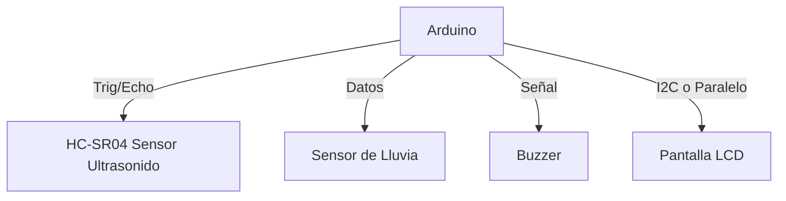

# 🌊 **Sistema de Monitorización de Crecidas en Tiempo Real usando IoT**

## Resumen General
> **Colombia enfrenta desafíos recurrentes debido a las crecidas de ríos**, especialmente durante la temporada de lluvias y fenómenos climáticos como *La Niña*. Estas inundaciones han causado daños significativos a infraestructuras y han afectado a numerosas comunidades.
>
> Este proyecto presenta el desarrollo de un **prototipo funcional de un sistema IoT** diseñado para monitorear en tiempo real los niveles de agua y las precipitaciones en ríos colombianos, con el objetivo de detectar crecidas y notificar *in situ* a las autoridades locales.

---

## Motivación y Justificación
> **Las inundaciones en Colombia han tenido un impacto devastador** en diversas regiones.
> 
> *Ejemplo:* En noviembre de 2024, el departamento del **Chocó** sufrió inundaciones que afectaron al 85% de su territorio, dejando a más de 100,000 personas damnificadas (*Fuente: FRANCE24.COM*).
>
> La detección temprana de crecidas es **esencial para minimizar daños** y proteger tanto a las comunidades como a la infraestructura.
>
> Un **sistema IoT** ofrece una solución eficiente y rentable para el monitoreo en tiempo real, permitiendo a las autoridades locales tomar decisiones informadas y oportunas.

---

## 📁 Estructura de la Documentación

  
Índice de Contenidos

  
1. [Solución Propuesta](#solución-propuesta)
2. [Restricciones de Diseño](#restricciones-de-diseño)
3. [Arquitectura Propuesta](#arquitectura-propuesta)
4. [Desarrollo Teórico Modular](#desarrollo-teórico-modular)
5. [Configuración Experimental, Resultados y Análisis](#configuración-experimental-resultados-y-análisis)
6. [Autoevaluación del Protocolo de Pruebas](#autoevaluación-del-protocolo-de-pruebas)
7. [Conclusiones, Retos y Trabajo Futuro](#conclusiones-retos-y-trabajo-futuro)
8. [Anexos](#anexos)

---

## ⚙️ **Solución Propuesta**

En busca de abordar la necesidad del monitoreo de crecientes mediante sensores, se propone implementar un sistema modular en **Arduino**, el cual sea capaz de detectar de manera eficaz las crecidas y la presencia de lluvias, generando alertas tempranas e informando en tiempo real. Este prototipo está compuesto por un **módulo de sensores** que recopila los datos del entorno a través del uso del sensor HC-SR04(ultrasonido) para medir la distancia a la cual estarían los rios de su nivel adecuado, un sensor de lluvia , un módulo de procesamiento basado en arduino que analiza la información y alerta dependiendo la situación y un módulo de salido que genera respuestas mediante la implementación de un **buzzer** que funciona como alarma sonora y una pantalla **lcd** para la visualización de los datos.

### **Restricciones de Diseño**

  
Más detalles aquí

  
#### Técnicas:
- Uso de microcontroladores como **Arduino o ESP32**.
- Sensores de nivel de agua y de precipitación compatibles.
- **Sistema autónomo** con bajo consumo energético.

#### Económicas:
- **Presupuesto limitado** para componentes.
- Selección de **hardware rentable**.

#### Regulatorias:
- **Cumplimiento con normativas locales** de instalación de dispositivos en cuerpos de agua.

#### Espacio:
- Instalación en **áreas remotas** con infraestructura limitada.

#### Escalabilidad:
- Posibilidad de **ampliar el sistema** a múltiples ubicaciones.

#### Temporales:
- Implementación **antes de la próxima temporada de lluvias**.

---

## **Arquitectura Propuesta**

El sistema se compone de **módulos de hardware y software** integrados para monitorear y alertar sobre crecidas en ríos.

### **Diagrama de Componentes del Sistema**

### **Tecnologías Utilizadas**
- **Microcontroladores**: Arduino.
- **Sensores**: Ultrasonido, Pluviómetro, DHT22.
---

## *Desarollo Teórico Modular* 📕🎯
### 1. Módulos del sistema  

#### 1.1 Módulo de procesamiento  🧑‍💻
**Función:** Recibe los datos de los sensores para procesamiento y toma de decisiones.  

- Interpreta la información obtenida por los sensores.  
- Activa las salidas en función de los valores detectados.  

#### 1.2 Módulo de sensores 🔔 
**Función:** Captura datos del entorno y los envía al procesador.  

- **Sensor Ultrasonido HC-SR04:** Mide la distancia a objetos cercanos. 
 
- **Sensor de lluvia:** Detecta la presencia de agua y determina si está lloviendo.

#### 1.3 Módulo de actuadores
**Funcioón:** Genera respuestas físicas en funcion de las decisiones del procesador.

-**Buzzer**: Alarma sonora que se adctiva inmediatamente se detecta cercanía rítica de la precipitación del agua.
-**Pantalla LCD**: Muestra en tiempo real la información de la distancia y que triage tiene la cercania. 

## Funcionamiento

<video width="320" height="240" controls>
  <source src="./resources/video/funcionamiento.mp4" type="video/mp4">
  Tu navegador no soporta el elemento video.
</video>

## Contribuciones

Si deseas contribuir a este proyecto, por favor sigue estos pasos:

1. Haz un fork del repositorio.
2. Crea una nueva rama (`git checkout -b feature/nueva-caracteristica`).
3. Realiza tus cambios y haz commit (`git commit -m 'Añadida nueva característica'`).
4. Empuja los cambios a tu rama (`git push origin feature/nueva-caracteristica`).
5. Crea un Pull Request.

---

## Referencias

1. **SunFounder** - Documentación oficial Kit V2 para Raspberry Pi: [SunFounder](https://docs.sunfounder.com/projects/sensorkit-v2-pi/en/latest//)

---

## 📎 **Anexos**

1. **Tinkercad** - Prototipado solución oficial: [Tinkercad](https://www.tinkercad.com/things/4sTa2o4PWZS/editel?sharecode=EIeFWOFX5DRneI9MpJu-DYvjm1JOlZI5UsiC8KP1DZc)

---

🚀 *Este proyecto fue desarrollado para la universidad de La Sabana. ¡Contribuciones y sugerencias son bienvenidas!*
