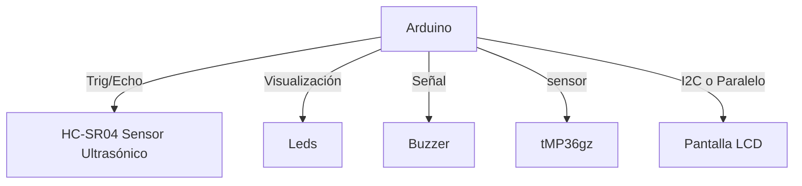
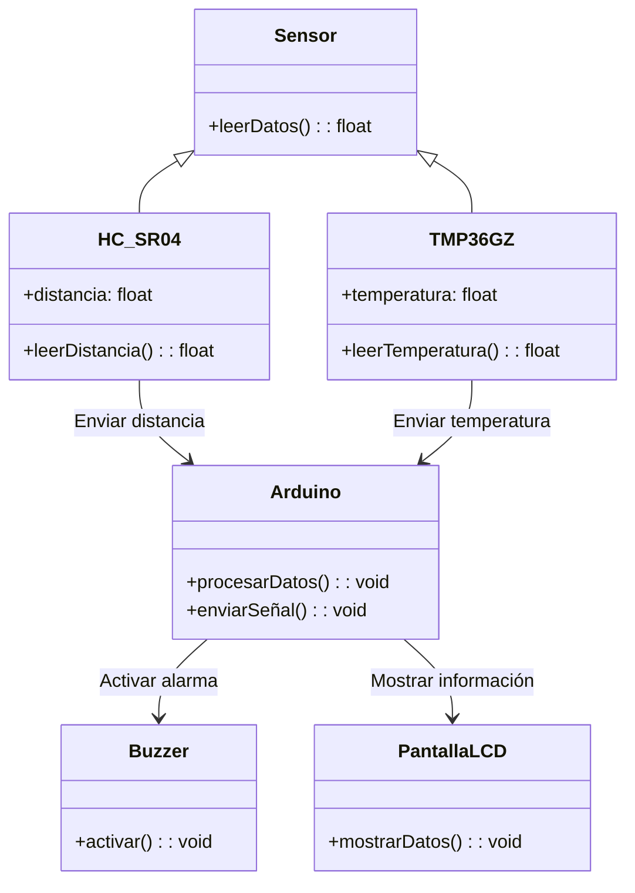
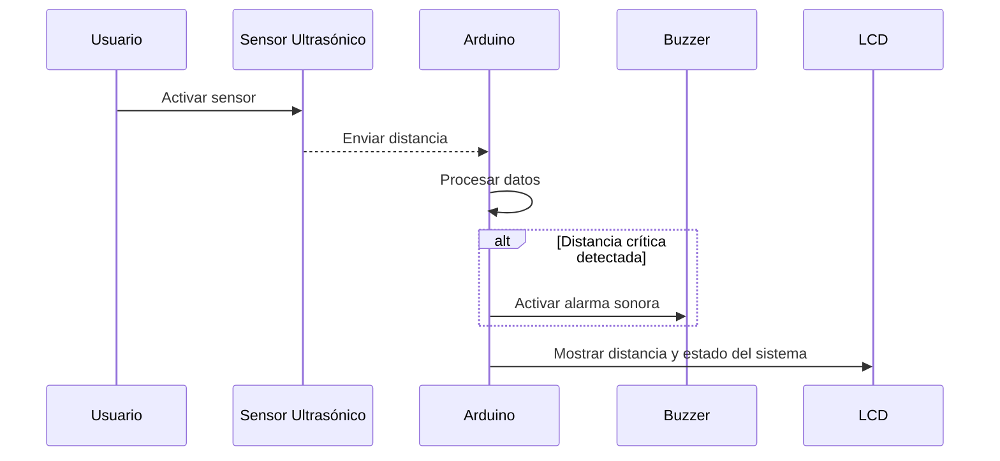

# 🌊 **Sistema de Monitorización de Crecidas en Tiempo Real usando IoT**

## Resumen General
> **Colombia enfrenta desafíos recurrentes debido a las crecidas de ríos**, especialmente durante la temporada de lluvias y fenómenos climáticos como *La Niña*. Estas inundaciones han causado daños significativos a infraestructuras y han afectado a numerosas comunidades.
>
> Este proyecto presenta el desarrollo de un **prototipo funcional de un sistema IoT** diseñado para monitorear en tiempo real los niveles de agua y las precipitaciones en ríos colombianos, con el objetivo de detectar crecidas y notificar *in situ* a las autoridades locales.

---

## Motivación y Justificación
> **Las inundaciones en Colombia han tenido un impacto devastador** en diversas regiones.
> 
> *Ejemplo:* En noviembre de 2024, el departamento del **Chocó** sufrió inundaciones que afectaron al 85% de su territorio, dejando a más de 100,000 personas damnificadas (*Fuente: FRANCE24.COM*).
>
> La detección temprana de crecidas es **esencial para minimizar daños** y proteger tanto a las comunidades como a la infraestructura.
>
> Un **sistema IoT** ofrece una solución eficiente y rentable para el monitoreo en tiempo real, permitiendo a las autoridades locales tomar decisiones informadas y oportunas.

---

## 📁 Estructura de la Documentación
<details>
  <summary>Índice de Contenidos</summary>
  
1. [Solución Propuesta](#solución-propuesta)
2. [Restricciones de Diseño](#restricciones-de-diseño)
3. [Arquitectura Propuesta](#arquitectura-propuesta)
4. [Desarrollo Teórico Modular](#desarrollo-teórico-modular)
5. [Configuración Experimental, Resultados y Análisis](#configuración-experimental-resultados-y-análisis)
6. [Autoevaluación del Protocolo de Pruebas](#autoevaluación-del-protocolo-de-pruebas)
7. [Conclusiones, Retos y Trabajo Futuro](#conclusiones-retos-y-trabajo-futuro)
8. [Anexos](#anexos)
</details>

---

## ⚙️ **Solución Propuesta**

En busca de abordar la necesidad del monitoreo de crecientes mediante sensores, se propone implementar un sistema modular en **Arduino**, el cual sea capaz de detectar de manera eficaz las crecidas y la presencia de lluvias, generando alertas tempranas e informando en tiempo real. Este prototipo está compuesto por un **módulo de sensores** que recopila los datos del entorno a través del uso del sensor HC-SR04(ultrasonido) para medir la distancia a la cual estarían los rios de su nivel adecuado, un sensor de lluvia , un módulo de procesamiento basado en arduino que analiza la información y alerta dependiendo la situación y un módulo de salido que genera respuestas mediante la implementación de un **buzzer** que funciona como alarma sonora y una pantalla **lcd** para la visualización de los datos.

### **Restricciones de Diseño**
<details>
  <summary>Más detalles aquí</summary>
  
#### Técnicas:
- Uso de microcontroladores como **Arduino o ESP32**.
- Sensores de nivel de agua y de precipitación compatibles.
- **Sistema autónomo** con bajo consumo energético.

#### Económicas:
- **Presupuesto limitado** para componentes.
- Selección de **hardware rentable**.

#### Regulatorias:
- **Cumplimiento con normativas locales** de instalación de dispositivos en cuerpos de agua.

#### Espacio:
- Instalación en **áreas remotas** con infraestructura limitada.

#### Escalabilidad:
- Posibilidad de **ampliar el sistema** a múltiples ubicaciones.

#### Temporales:
- Implementación **antes de la próxima temporada de lluvias**.
</details>

---

## **Arquitectura Propuesta**

El sistema se compone de **módulos de hardware y software** integrados para monitorear y alertar sobre crecidas en ríos.

### **Diagrama de Componentes del Sistema**


### Diagrama de Clases


### Diagrama de Secuencias



### **Tecnologías Utilizadas**
- **Microcontroladores**: Arduino.
- **Sensores**: Ultrasónico,tmp36GZ.
- **Actuadores**: Leds, buzzer, lcdI2C.
---

## *Desarollo Teórico Modular* 📕🎯
### 1. Módulos del sistema  

#### 1.1 Módulo de procesamiento  🧑‍💻
**Función:** Recibe los datos de los sensores para procesamiento y toma de decisiones.  

- Interpreta la información obtenida por los sensores.  
- Activa las salidas en función de los valores detectados.  

#### 1.2 Módulo de sensores 🔔 
**Función:** Captura datos del entorno y los envía al procesador.  

- **Sensor Ultrasónico HC-SR04:** Mide la distancia a objetos cercanos.
  

- **Sensor de temperatura:** Detecta la temperatura actual.
  


#### 1.3 Módulo de actuadores
**Funcioón:** Genera respuestas físicas en funcion de las decisiones del procesador.

-**Buzzer**: Alarma sonora que se adctiva inmediatamente se detecta cercanía rítica de la precipitación del agua.


-**Pantalla LCD**: Muestra en tiempo real la información de la distancia y que triage tiene la cercania. 

## 🧪 Configuración Experimental, Resultados y Análisis  

### 🔧 **Configuración Experimental**  
Para evaluar el rendimiento del sistema de detección de distancias, se realizaron pruebas en diferentes escenarios con el sensor ultrasónico **HC-SR04**.  

#### 📌 **Condiciones de prueba:**  
1. **Entorno controlado:** Se realizaron mediciones en un espacio cerrado con objetos de diferentes materiales y superficies.  
2. **Variación de distancias:** Se colocaron obstáculos a **5 cm, 15 cm, 25 cm y 40 cm** para comprobar los cambios de estado.  
3. **Verificación del LCD y LEDs:** Se observó si la pantalla mostraba los valores correctos y los LEDs respondían adecuadamente.  
4. **Buzzer:** Se verificó la activación del buzzer en los estados *WARNING* y *CRITICAL*.  

---

### 📊 **Resultados**  

| Distancia (cm) | Estado Detectado | LED Encendido | Buzzer |
|---------------|----------------|--------------|--------|
| + 31 cm        | NORMAL         | Verde       | ❌ Apagado |
| 30 cm        | CAUTION        | Verde + Amarillo | 🔉 Suave  |
| 20 cm        | WARNING        | Amarillo    | 🔔 Intermitente  |
| 10 cm         | CRITICAL       | Rojo        | 🚨 Intermitente |

- 📌 **El sistema respondió correctamente** a los cambios de distancia, activando los LEDs y el buzzer según la tabla.  
- 📌 **Las mediciones fueron consistentes** en todas las pruebas, con una desviación mínima de ±1 cm.  
- 📌 **La pantalla LCD mostró correctamente los valores de distancia y estado.**  

---

### 📈 **Análisis**  

- **Precisión del sensor:** El sensor **HC-SR04** mostró lecturas estables en distancias entre **5 cm y 100 cm**, pero comenzó a mostrar fluctuaciones leves en valores superiores a **300 cm**.  
- **Retraso en la actualización:** Debido al uso del buffer de promedios, los cambios de estado no fueron instantáneos, sino que tomaron **500 ms** para estabilizarse.  
- **Interferencia del entorno:** Superficies irregulares o materiales absorbentes de sonido (como tela o espuma) afectaron la precisión de las mediciones.  

### 📌 **Mejoras Propuestas**  

✅ Implementar un filtro para eliminar lecturas erróneas en distancias extremas.  
✅ Ajustar el intervalo de actualización del buzzer para reducir interferencias.  
✅ Explorar el uso de sensores adicionales para mejorar la precisión en entornos complejos.  

---

📌 **Conclusión:** El sistema demostró ser **efectivo y confiable** en la detección de obstáculos dentro del rango de operación del sensor ultrasónico, con una correcta activación de las señales visuales y auditivas.  

---

### 📝 **Autoevaluación del Protocolo de Pruebas** 

#### ✅ **1. Cobertura de Pruebas**
- Se han probado todos los estados del sistema ( estado normal, estado Caution, Estado Critical).
- Se han verificado que las distancias que mmide el sensor ultrasonico sean correctas.
- Se verificó la respuesta del buzzer y los leds ante el cambio de estado.
- Se revisó la información presentada en la pantalla LCD.

#### 🛠 **2. Precisión y Reproducibilidad** 
- Se realizaron múltiples mediciones a la misma distancia para validar la consistencia de los resultados.  

#### 🛑 **4. Identificación de Problemas Potenciales**  
❗ En algunas pruebas, el sensor HC-SR04 mostró pequeñas fluctuaciones en la lectura.  
❗ El buzzer podría requerir ajustes en su intensidad para mejorar la percepción del usuario.  


---
## Galería


## Funcionamiento

<video width="320" height="240" controls>
  <source src="https://raw.githubusercontent.com/JohnRojas06289/IOT2025/main/resources/video/funcionamiento.mp4" type="video/mp4">
  Tu navegador no soporta el elemento video.
</video>

## Contribuciones

Si deseas contribuir a este proyecto, por favor sigue estos pasos:

1. Haz un fork del repositorio.
2. Crea una nueva rama (`git checkout -b feature/nueva-caracteristica`).
3. Realiza tus cambios y haz commit (`git commit -m 'Añadida nueva característica'`).
4. Empuja los cambios a tu rama (`git push origin feature/nueva-caracteristica`).
5. Crea un Pull Request.

---

## Referencias

1. **SunFounder** - Documentación oficial Kit V2 para Raspberry Pi: [SunFounder](https://docs.sunfounder.com/projects/sensorkit-v2-pi/en/latest//)

---

## 📎 **Anexos**

1. **Tinkercad** - Prototipado solución oficial: [Tinkercad](https://www.tinkercad.com/things/4sTa2o4PWZS/editel?sharecode=EIeFWOFX5DRneI9MpJu-DYvjm1JOlZI5UsiC8KP1DZc)
2. **Video** - Video de funcionamiento: [Video funcionamiento](https://unisabanaedu-my.sharepoint.com/:v:/g/personal/johnrove_unisabana_edu_co/EbKH4edEi4ZMiHfLPR-a3_wBw8cd4eqP4fy7lcsYe58xOQ?e=Y46gva)
3. **Código** - Código fuente: [Código](https://raw.githubusercontent.com/JohnRojas06289/IOT2025/main/resources/code.c)


---

🚀 *Este proyecto fue desarrollado para la universidad de La Sabana. ¡Contribuciones y sugerencias son bienvenidas!*

### INTEGRANTES 
John Jairo Rojas Vergara

Oscar David Vergara Moreno

Santiago Gavilán Paez


## Hola

```mermaid
gantt
    title Cronograma Detallado del Proyecto de Automatización de T-Alem
    dateFormat  YYYY-MM-DD
    axisFormat  %m-%d

    section Levantamiento de Información (Entrega1: 19 de febrero)
    Reunión inicial del equipo                 :a1, 2025-01-22, 1d
    Visita a la empresa y recolección de datos   :a2, after a1, 3d
    Análisis de procesos (inventario y calidad)  :a3, after a2, 5d
    Identificación del problema y necesidad      :a4, after a3, 3d
    Definición de proyecto y objetivos SMART       :a5, after a4, 3d
    Definición de la metodología                 :a6, after a5, 3d
    Elaboración del cronograma                   :a7, after a6, 3d
    Definición del alcance y riesgos             :a8, after a7, 3d
    Revisión preliminar grupal (fase1)             :a9, after a8, 2d
    Entrega1: Documentación y anexos             :a10, after a9, 3d
    Reunión con validador (fábrica)                :a11, after a10, 2d
    Reunión con validador (profesor)               :a12, after a11, 2d
    Ajustes finales y envío del documento         :a13, after a12, 2d

    section Anteproyecto (Entrega2: 2 de abril)
    Reunión inicial del equipo (fase2)            :b1, 2025-02-20, 1d
    Resumen de hallazgos (fase1)                  :b2, after b1, 2d
    Restricciones de diseño                     :b3, after b2, 4d
    Revisión y análisis de antecedentes           :b4, after b3, 5d
    Revisión preliminar grupal (fase2)             :b5, after b4, 2d
    Entrega2: Documento anteproyecto              :b6, after b5, 4d
    Reunión con validador (fábrica)                :b7, after b6, 2d
    Reunión con validador (profesor)               :b8, after b7, 2d
    Ajustes finales y envío del documento         :b9, after b8, 2d
    Preparación de la presentación                :b10, after b9, 3d
    Presentación y sustentación                   :b11, after b10, 1d

    section Proyecto (Entrega3: 14 de mayo)
    Reunión inicial del equipo (fase3)            :c1, 2025-04-03, 1d
    Desarrollo del automatismo                    :c2, after c1, 25d
    Pruebas internas del equipo                   :c3, after c2, 5d
    Revisión preliminar grupal (fase3)             :c4, after c3, 2d
    Entrega3: Documentación del proyecto          :c5, after c4, 4d
    Reunión con validador (fábrica)                :c6, after c5, 2d
    Reunión con validador (profesor)               :c7, after c6, 2d
    Ajustes finales y envío del documento         :c8, after c7, 2d
    Evaluación de resultados y análisis          :c9, after c8, 5d
    Informe final y presentación                  :c10, after c9, 3d

    section Recursos Humanos
    John      :d1, 2025-01-22, 120d
    Santiago  :d2, 2025-01-22, 120d
    Oscar     :d3, 2025-01-22, 120d

    section Recursos Materiales
    Computadora y software                        :e1, 2025-01-22, 120d
    Cámara para visita a la empresa               :e2, 2025-01-22, 120d
    Software de gestión de proyectos (opcional)    :e3, 2025-01-22, 120d

  ```


Aquí tienes una tabla detallada con cada actividad, su responsable asignado, fecha de inicio y fecha de fin: ```markdown | Actividad | Responsable | Fecha de inicio | Fecha de fin | |--------------------------------------------------|---------------------------|-------------------|------------------| | Reunión inicial del equipo (fase 1) | John, Santiago, Oscar | 2025-01-22 | 2025-01-22 | | Visita a la empresa y recolección de datos | John, Santiago, Oscar | 2025-01-25 | 2025-01-28 | | Análisis de procesos (inventario y calidad) | John, Santiago, Oscar | 2025-01-29 | 2025-02-03 | | Identificación del problema y necesidad | John, Santiago, Oscar | 2025-02-04 | 2025-02-06 | | Definición de proyecto y objetivos SMART | John, Santiago, Oscar | 2025-02-07 | 2025-02-09 | | Definición de la metodología | John, Santiago, Oscar | 2025-02-10 | 2025-02-12 | | Elaboración del cronograma | John, Santiago, Oscar | 2025-02-13 | 2025-02-15 | | Definición del alcance y riesgos | John, Santiago, Oscar | 2025-02-16 | 2025-02-18 | | Revisión preliminar grupal (fase 1) | John, Santiago, Oscar | 2025-02-19 | 2025-02-20 | | Entrega 1: Documentación y anexos | John, Santiago, Oscar | 2025-02-21 | 2025-02-24 | | Reunión con validador (fábrica) | John, Santiago, Oscar | 2025-02-25 | 2025-02-27 | | Reunión con validador (profesor) | John, Santiago, Oscar | 2025-02-28 | 2025-03-02 | | Ajustes finales y envío del documento | John, Santiago, Oscar | 2025-03-03 | 2025-03-05 | | Reunión inicial del equipo (fase 2) | John, Santiago, Oscar | 2025-02-20 | 2025-02-20 | | Resumen de hallazgos (fase 1) | John, Santiago, Oscar | 2025-02-22 | 2025-02-24 | | Restricciones de diseño | John, Santiago, Oscar | 2025-02-25 | 2025-02-28 | | Revisión y análisis de antecedentes | John, Santiago, Oscar | 2025-03-01 | 2025-03-05 | | Revisión preliminar grupal (fase 2) | John, Santiago, Oscar | 2025-03-06 | 2025-03-07 | | Entrega 2: Documento anteproyecto | John, Santiago, Oscar | 2025-03-08 | 2025-03-11 | | Reunión con validador (fábrica) | John, Santiago, Oscar | 2025-03-12 | 2025-03-14 | | Reunión con validador (profesor) | John, Santiago, Oscar | 2025-03-15 | 2025-03-17 | | Ajustes finales y envío del documento | John, Santiago, Oscar | 2025-03-18 | 2025-03-20 | | Preparación de la presentación | John, Santiago, Oscar | 2025-03-21 | 2025-03-23 | | Presentación y sustentación | John, Santiago, Oscar | 2025-03-24 | 2025-03-24 | | Reunión inicial del equipo (fase 3) | John, Santiago, Oscar | 2025-04-03 | 2025-04-03 | | Desarrollo del automatismo | John, Santiago, Oscar | 2025-04-04 | 2025-05-05 | | Pruebas internas del equipo | John, Santiago, Oscar | 2025-05-06 | 2025-05-10 | | Revisión preliminar grupal (fase 3) | John, Santiago, Oscar | 2025-05-11 | 2025-05-12 | | Entrega 3: Documentación del proyecto | John, Santiago, Oscar | 2025-05-13 | 2025-05-16 | | Reunión con validador (fábrica) | John, Santiago, Oscar | 2025-05-17 | 2025-05-19 | | Reunión con validador (profesor) | John, Santiago, Oscar | 2025-05-20 | 2025-05-22 | | Ajustes finales y envío del documento | John, Santiago, Oscar | 2025-05-23 | 2025-05-25 | | Evaluación de resultados y análisis | John, Santiago, Oscar | 2025-05-26 | 2025-05-31 | | Informe final y presentación | John, Santiago, Oscar | 2025-06-01 | 2025-06-03 | | Computadora y software | John, Santiago, Oscar | 2025-01-22 | 2025-06-03 | | Cámara para visita a la empresa | John, Santiago, Oscar | 2025-01-25 | 2025-01-28 | | Software de gestión de proyectos (opcional) | John, Santiago, Oscar | 2025-01-22 | 2025-06-03 | ```


