# 🌊 **Sistema de Monitorización de Crecidas en Tiempo Real usando IoT**

## Resumen General
> **Colombia enfrenta desafíos recurrentes debido a las crecidas de ríos**, especialmente durante la temporada de lluvias y fenómenos climáticos como *La Niña*. Estas inundaciones han causado daños significativos a infraestructuras y han afectado a numerosas comunidades.
>
> Este proyecto presenta el desarrollo de un **prototipo funcional de un sistema IoT** diseñado para monitorear en tiempo real los niveles de agua y las precipitaciones en ríos colombianos, con el objetivo de detectar crecidas y notificar *in situ* a las autoridades locales.

---

## Motivación y Justificación
> **Las inundaciones en Colombia han tenido un impacto devastador** en diversas regiones.
> 
> *Ejemplo:* En noviembre de 2024, el departamento del **Chocó** sufrió inundaciones que afectaron al 85% de su territorio, dejando a más de 100,000 personas damnificadas (*Fuente: FRANCE24.COM*).
>
> La detección temprana de crecidas es **esencial para minimizar daños** y proteger tanto a las comunidades como a la infraestructura.
>
> Un **sistema IoT** ofrece una solución eficiente y rentable para el monitoreo en tiempo real, permitiendo a las autoridades locales tomar decisiones informadas y oportunas.

---

## 📁 Estructura de la Documentación

  
Índice de Contenidos

  
1. [Solución Propuesta](#solución-propuesta)
2. [Restricciones de Diseño](#restricciones-de-diseño)
3. [Arquitectura Propuesta](#arquitectura-propuesta)
4. [Desarrollo Teórico Modular](#desarrollo-teórico-modular)
5. [Configuración Experimental, Resultados y Análisis](#configuración-experimental-resultados-y-análisis)
6. [Autoevaluación del Protocolo de Pruebas](#autoevaluación-del-protocolo-de-pruebas)
7. [Conclusiones, Retos y Trabajo Futuro](#conclusiones-retos-y-trabajo-futuro)
8. [Anexos](#anexos)

---

## ⚙️ **Solución Propuesta**

En busca de abordar la necesidad del monitoreo de crecientes mediante sensores, se propone implementar un sistema modular en **Arduino**, el cual sea capaz de detectar de manera eficaz las crecidas y la presencia de lluvias, generando alertas tempranas e informando en tiempo real. Este prototipo está compuesto por un **módulo de sensores** que recopila los datos del entorno a través del uso del sensor HC-SR04(ultrasonido) para medir la distancia a la cual estarían los rios de su nivel adecuado, un sensor de lluvia , un módulo de procesamiento basado en arduino que analiza la información y alerta dependiendo la situación y un módulo de salido que genera respuestas mediante la implementación de un **buzzer** que funciona como alarma sonora y una pantalla **lcd** para la visualización de los datos.

### **Restricciones de Diseño**

  
Más detalles aquí

  
#### Técnicas:
- Uso de microcontroladores como **Arduino o ESP32**.
- Sensores de nivel de agua y de precipitación compatibles.
- **Sistema autónomo** con bajo consumo energético.

#### Económicas:
- **Presupuesto limitado** para componentes.
- Selección de **hardware rentable**.

#### Regulatorias:
- **Cumplimiento con normativas locales** de instalación de dispositivos en cuerpos de agua.

#### Espacio:
- Instalación en **áreas remotas** con infraestructura limitada.

#### Escalabilidad:
- Posibilidad de **ampliar el sistema** a múltiples ubicaciones.

#### Temporales:
- Implementación **antes de la próxima temporada de lluvias**.

---

## **Arquitectura Propuesta**

El sistema se compone de **módulos de hardware y software** integrados para monitorear y alertar sobre crecidas en ríos.

### **Diagrama de Componentes del Sistema**

### Diagrama de Clases

```mermaid

classDiagram
    class Sensor {
        +leerDatos(): float
    }
    
    class HC_SR04 {
        +distancia: float
        +leerDistancia(): float
    }
    
    class Arduino {
        +procesarDatos(): void
        +enviarSeñal(): void
    }
    
    class Buzzer {
        +activar(): void
    }
    
    class PantallaLCD {
        +mostrarDatos(): void
    }
    
    Sensor <|-- HC_SR04
    HC_SR04 --> Arduino : Enviar datos
    Arduino --> Buzzer : Activar alarma
    Arduino --> PantallaLCD : Mostrar información

```

### Diagrama de Secuencias

```mermaid
sequenceDiagram
    participant Usuario
    participant HC_SR04 as Sensor Ultrasónico
    participant Arduino
    participant Buzzer
    participant LCD

    Usuario->>HC_SR04: Activar sensor
    HC_SR04-->>Arduino: Enviar distancia

    Arduino->>Arduino: Procesar datos
    alt Distancia crítica detectada
        Arduino->>Buzzer: Activar alarma sonora
    end

    Arduino->>LCD: Mostrar distancia y estado del sistema

```

### **Tecnologías Utilizadas**
- **Microcontroladores**: Arduino.
- **Sensores**: Ultrasónico,tmp36GZ.
- **Actuadores**: Leds, buzzer, lcdI2C.
---

## *Desarollo Teórico Modular* 📕🎯
### 1. Módulos del sistema  

#### 1.1 Módulo de procesamiento  🧑‍💻
**Función:** Recibe los datos de los sensores para procesamiento y toma de decisiones.  

- Interpreta la información obtenida por los sensores.  
- Activa las salidas en función de los valores detectados.  

#### 1.2 Módulo de sensores 🔔 
**Función:** Captura datos del entorno y los envía al procesador.  

- **Sensor Ultrasónico HC-SR04:** Mide la distancia a objetos cercanos.
  

- **Sensor de temperatura:** Detecta la temperatura actual.
  

#### 1.3 Módulo de actuadores
**Funcioón:** Genera respuestas físicas en funcion de las decisiones del procesador.

-**Buzzer**: Alarma sonora que se adctiva inmediatamente se detecta cercanía rítica de la precipitación del agua.

-**Pantalla LCD**: Muestra en tiempo real la información de la distancia y que triage tiene la cercania. 

## 🧪 Configuración Experimental, Resultados y Análisis  

### 🔧 **Configuración Experimental**  
Para evaluar el rendimiento del sistema de detección de distancias, se realizaron pruebas en diferentes escenarios con el sensor ultrasónico **HC-SR04**.  

#### 📌 **Condiciones de prueba:**  
1. **Entorno controlado:** Se realizaron mediciones en un espacio cerrado con objetos de diferentes materiales y superficies.  
2. **Variación de distancias:** Se colocaron obstáculos a **5 cm, 15 cm, 25 cm y 40 cm** para comprobar los cambios de estado.  
3. **Verificación del LCD y LEDs:** Se observó si la pantalla mostraba los valores correctos y los LEDs respondían adecuadamente.  
4. **Buzzer:** Se verificó la activación del buzzer en los estados *WARNING* y *CRITICAL*.  

---

### 📊 **Resultados**  

| Distancia (cm) | Estado Detectado | LED Encendido | Buzzer |
|---------------|----------------|--------------|--------|
| + 31 cm        | NORMAL         | Verde       | ❌ Apagado |
| 30 cm        | CAUTION        | Verde + Amarillo | 🔉 Suave  |
| 20 cm        | WARNING        | Amarillo    | 🔔 Intermitente  |
| 10 cm         | CRITICAL       | Rojo        | 🚨 Intermitente |

- 📌 **El sistema respondió correctamente** a los cambios de distancia, activando los LEDs y el buzzer según la tabla.  
- 📌 **Las mediciones fueron consistentes** en todas las pruebas, con una desviación mínima de ±1 cm.  
- 📌 **La pantalla LCD mostró correctamente los valores de distancia y estado.**  

---

### 📈 **Análisis**  

- **Precisión del sensor:** El sensor **HC-SR04** mostró lecturas estables en distancias entre **5 cm y 100 cm**, pero comenzó a mostrar fluctuaciones leves en valores superiores a **300 cm**.  
- **Retraso en la actualización:** Debido al uso del buffer de promedios, los cambios de estado no fueron instantáneos, sino que tomaron **500 ms** para estabilizarse.  
- **Interferencia del entorno:** Superficies irregulares o materiales absorbentes de sonido (como tela o espuma) afectaron la precisión de las mediciones.  

### 📌 **Mejoras Propuestas**  

✅ Implementar un filtro para eliminar lecturas erróneas en distancias extremas.  
✅ Ajustar el intervalo de actualización del buzzer para reducir interferencias.  
✅ Explorar el uso de sensores adicionales para mejorar la precisión en entornos complejos.  

---

📌 **Conclusión:** El sistema demostró ser **efectivo y confiable** en la detección de obstáculos dentro del rango de operación del sensor ultrasónico, con una correcta activación de las señales visuales y auditivas.  

---

### 📝 **Autoevaluación del Protocolo de Pruebas** 

#### ✅ **1. Cobertura de Pruebas**
- Se han probado todos los estados del sistema ( estado normal, estado Caution, Estado Critical).
- Se han verificado que las distancias que mmide el sensor ultrasonico sean correctas.
- Se verificó la respuesta del buzzer y los leds ante el cambio de estado.
- Se revisó la información presentada en la pantalla LCD.

#### 🛠 **2. Precisión y Reproducibilidad** 
- Se realizaron múltiples mediciones a la misma distancia para validar la consistencia de los resultados.  

#### 🛑 **4. Identificación de Problemas Potenciales**  
❗ En algunas pruebas, el sensor HC-SR04 mostró pequeñas fluctuaciones en la lectura.  
❗ El buzzer podría requerir ajustes en su intensidad para mejorar la percepción del usuario.  

---
## Galería

## Funcionamiento

<video width="320" height="240" controls>
  <source src="https://raw.githubusercontent.com/JohnRojas06289/IOT2025/main/resources/video/funcionamiento.mp4" type="video/mp4">
  Tu navegador no soporta el elemento video.
</video>

## Contribuciones

Si deseas contribuir a este proyecto, por favor sigue estos pasos:

1. Haz un fork del repositorio.
2. Crea una nueva rama (`git checkout -b feature/nueva-caracteristica`).
3. Realiza tus cambios y haz commit (`git commit -m 'Añadida nueva característica'`).
4. Empuja los cambios a tu rama (`git push origin feature/nueva-caracteristica`).
5. Crea un Pull Request.

---

## Referencias

1. **SunFounder** - Documentación oficial Kit V2 para Raspberry Pi: [SunFounder](https://docs.sunfounder.com/projects/sensorkit-v2-pi/en/latest//)

---

## 📎 **Anexos**

1. **Tinkercad** - Prototipado solución oficial: [Tinkercad](https://www.tinkercad.com/things/4sTa2o4PWZS/editel?sharecode=EIeFWOFX5DRneI9MpJu-DYvjm1JOlZI5UsiC8KP1DZc)

---

🚀 *Este proyecto fue desarrollado para la universidad de La Sabana. ¡Contribuciones y sugerencias son bienvenidas!*

### INTEGRANTES 
John Jairo Rojas Vergara

Oscar David Vergara Moreno

Santiago Gavilán Paez
